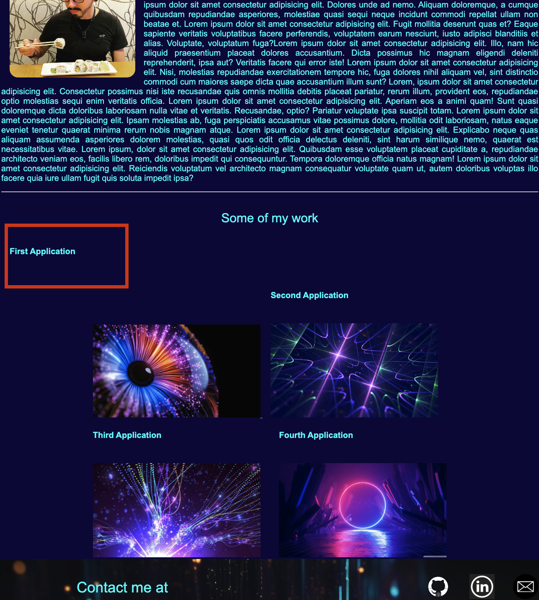

# 02 Challenge - Portfolio Website

## My Task

A portfolio used to introduce myself to potential employers. The site contains informaiton about me, my work, and how to reach me. 


## User Story

```
AS AN employer
I WANT to view a potential employee's deployed portfolio of work samples
SO THAT I can review samples of their work and assess whether they're a good candidate for an open position
```


## Acceptance Criteria

Here are the critical requirements necessary to develop a portfolio that satisfies a typical hiring manager’s needs:

```
GIVEN I need to sample a potential employee's previous work
WHEN I load their portfolio
THEN I am presented with the developer's name, a recent photo or avatar, and links to sections about them, their work, and how to contact them
WHEN I click one of the links in the navigation
THEN the UI scrolls to the corresponding section
WHEN I click on the link to the section about their work
THEN the UI scrolls to a section with titled images of the developer's applications
WHEN I am presented with the developer's first application
THEN that application's image should be larger in size than the others
WHEN I click on the images of the applications
THEN I am taken to that deployed application
WHEN I resize the page or view the site on various screens and devices
THEN I am presented with a responsive layout that adapts to my viewport
```


## Screenshot & link

The following screenshot and URL shows the web application's appearance, functionality, and shortcomings:

https://gera1313.github.io/Portfolio-Challenge-2/ [GitHub]


The following image shows where the title was not behaving as intended and could not figure out how to fix it:



The following image shows how Live Server correctly displays the footer background image, but the deployed site does not for some reason. You can see the header image in one of the above screenshots. 


## Installation

N/A

## Usage

Website will be used to indtroduce myself and my work to others. 

## Credits

N/A

## License

N/A